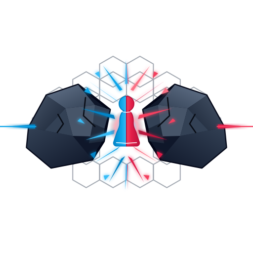
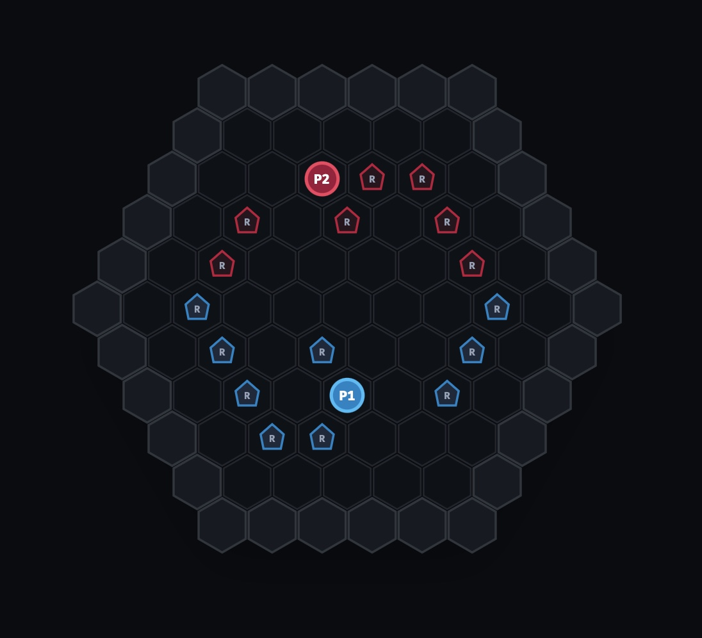

# 💥 CRUNCH (Rock Chess)

<p align="center">
  
</p>

<p align="center">
  <b>A game of long-form strategy, 3-axis spatial control, and psychological deception.</b><br />
  Trap the enemy between <i>A Rock and a Hard Place</i> to achieve <b>CRUNCH</b>.
</p>

<p align="center">
  <a href="https://samsoupsauce.github.io/crunch/"><strong>🎮 Play Live in Browser</strong></a> •
  <a href="#-rules">Rules</a> •
  <a href="#️-software-stack">Software Stack</a> •
  <a href="RULES.md">Official Rules Spec</a>
</p>

---

## 📸 Preview



---

## 📖 Origin & Summary

Crunch was invented by a college student on a paper plate using a pen to draw hexagonal grid lines and pebbles as... well, rocks.

The core gameplay centers on trapping the opposing mover between neutral obstacles and immovable boundaries to trigger a lethal **Crunch**. Rock colors are purely cosmetic and positional—once play begins, **either player can move ANY rock on the board**, making every push a potential trap or counter-offensive.

---

## ⚡ Features

- **🎮 Responsive Main Menu**: Seamless navigation with Singleplayer (local play against a friend or self), online room creation, and room joining.
- **🌐 Online 2-Player Multiplayer**:
  - Ephemeral 24-hour rooms with lightweight REST turn synchronization.
  - Quick room code sharing (`📋 Copy Room Code`) and deep linking via `?room=ROOM-...`.
  - Inactivity slot reopening and seamless tab-scoped session recovery.
  - Live spectator mode for matches in progress.
- **🔊 Web Audio API Synthesizer**: Pure procedural sound effects for movement steps, rock pushes, and crunch impacts with no external audio assets.
- **📜 Vector Event Log**: Move-by-move real-time match telemetry.
- **📱 Zero-Dependency Web Client**: Pure HTML5, SVG board rendering, Vanilla JavaScript, and Tailwind CSS (via CDN).

---

## 📜 Rules

### The Board
- Hexagonal grid with radius $R = 5$ (side length of 5 hexagons, **61 playable spaces**).
- Movement occurs along 6 cardinal directions ($60^\circ$ vectors).
- Outer perimeter edge serves as an immovable wall.

### Turn Order
- **Player 1 (Blue)** moves first.
- Players alternate turns, performing exactly **one legal action** per turn.
- Play continues until a mover is crushed (**Crunch**) or a player surrenders.

### Movement & Force Limit
1. **Universal Rock Control**: Either player may push any rock on the board.
2. **Simple Move**: Move your mover one space into an adjacent empty hex.
3. **Pushing a Rock**: Push an adjacent rock one hex forward into an empty space (*follow-through movement advances both the rock and your mover*).
4. **Physical Force Limit (1 Unit = 1 Rock)**: A mover can only push a single rock. You cannot push multiple rocks in a line, nor push a rock into a wall.
5. **Pushing Opponents**: A mover can push an adjacent opponent into an empty hex.

### 💥 The Crunch Condition
A player immediately wins by pushing a rock into the enemy mover when the space directly behind the enemy (along the vector of the push) is blocked by:
- A boundary wall, or
- Another static rock.

---

## 🛠️ Software Stack

- **Client**:
  - HTML5 & SVG (Vector rendering)
  - Vanilla JavaScript (Zero build step)
  - Tailwind CSS (CDN)
  - Web Audio API (Procedural sound synthesis)
- **Desktop Application**:
  - Electron 34 (Frameless / hiddenInset native window styling)
  - electron-builder (Cross-platform builds for macOS, Windows, Linux)
- **Mobile Application (Android)**:
  - Capacitor 8 (Hardware-accelerated native System WebView wrapper)
  - Touch manipulation optimization, notch/safe-area viewport, and native back button handling
- **Backend (`server/`)**:
  - Go (Standard library REST API)
  - In-memory 24-hour TTL room store with automated Janitor cleanup
- **Infrastructure & Deployment**:
  - **Frontend**: GitHub Pages ([samsoupsauce.github.io/crunch](https://samsoupsauce.github.io/crunch/))
  - **Backend**: Google Cloud Run & Artifact Registry via Cloud Build CI/CD

---

## 🚀 Local Development

### 1. Web Client Only (Local Mode)
Simply open `index.html` in any modern web browser:
```bash
open index.html
```

### 2. Full Stack (Local Backend + Web Client)
Run the Go coordination server:
```bash
cd server
go run ./cmd/server
```
The server will start at `http://localhost:8080`, automatically serving `index.html` and the REST API.

### 3. Desktop Application (Electron)
Run the desktop app in development mode:
```bash
npm start
```

Build standalone desktop executables and installers:
```bash
# Package unpackaged app folder into dist/
npm run pack

# Build distributable installers (.dmg, .zip, .exe, AppImage)
npm run dist

# Target-specific platform builds
npm run dist:mac
npm run dist:win
npm run dist:linux
```

### 4. Android Application (Capacitor)
Sync web assets and launch in Android Studio:
```bash
# Sync web bundle and assets into Android project
npm run android:sync

# Open project in Android Studio (build APK, run emulator or physical device)
npm run android:open

# Or build debug APK from CLI (requires Java and Android SDK configured)
npm run android:build
```

### Run Tests
```bash
# Frontend session test suite
node test_session.js

# Backend Go tests
cd server && go test -v ./...
```

---

## 📄 License

Licensed under the [MIT License](LICENSE).
